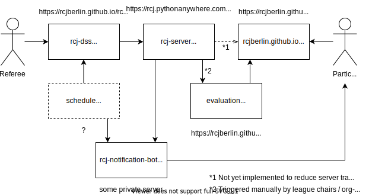

# general

Overview over the different repositories and services:

Further documents (German):
* [Merkzettel für Schiedsrichter](./merkzettel/merkzettel.md) (sheet with helpful information for referees)
* [Notizen für Schiedsrichter-Meeting](./meeting_referees.md) (notes for meeting with referees)
* [Notizen für Team-Leader-Meeting](./meeting_teamleaders.md) (notes for meeting with team leaders)
