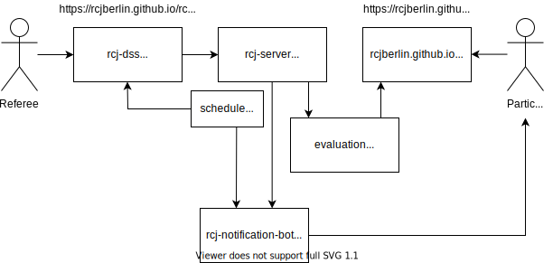

# general

Overview over the different repositories and services:

Further documents (German):
* [Merkzettel für Schiedsrichter](./merkzettel/merkzettel.md) (sheet with helpful information for referees)
* [Notizen für Schiedsrichter-Meeting](./meeting_referees.md) (notes for meeting with referees)
* [Notizen für Team-Leader-Meeting](./meeting_teamleaders.md) (notes for meeting with team leaders)

You will find all parcours of the past competitions here:
* [2019](./parcours/2019)
* [2020](./parcours/2020)
* [2022](./parcours/2022)

If you are interested in the details for each run / digital scoring sheets (used at 2020 competition, https://github.com/rcjberlin/rcj-dss) just contact us.
We would then publish them here as JSONs.
If you want to have access to other data from past competitions (timetables, results, ...) you can contact us as well.
