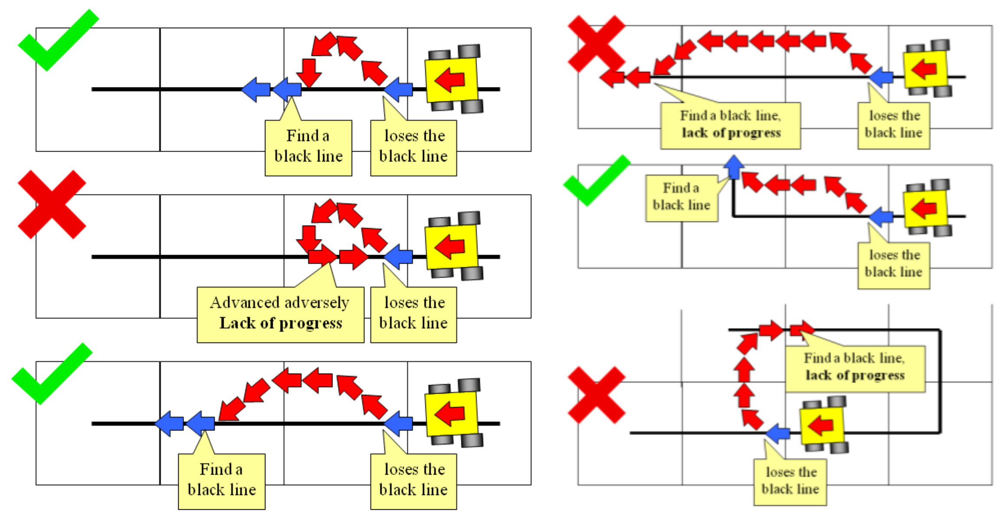

<table border="0"><tr>
<td></td>
<td>Rescue Line <b>Merkzettel für Schiedsrichter<b></td>
</tr></table>

**Vor dem Lauf / Einweisung zu Beginn**:
* Hindernis etc. wieder korrekt positionieren
* hoher oder flacher Evakuierungspunkt?
* 8 Minuten Zeit (Lauf inkl. Putzen, Kalibrieren, Checkpoints)
* Kalibieren (Roboter darf sich nicht von selbst bewegen)
* Checkpoints setzen (nicht auf Kacheln mit Punkten; gilt in alle Richtungen; können während des Laufs bewegt werden)
- Eingriff bei Lack of Progress oder Gefahr
- Lack of Progress kann selbst verkündet werden, taktisches LoP erlaubt
- abgefallene Teile bleiben liegen, verschobene Hindernisse bleiben stehen
- Neustart erlaubt, kein Programmwechsel

* Anmerkungen/Beschwerden vermerken
* Ok/Unterschrift &rarr; Team-Captain mit Schirizettel einverstanden

Ab 5min Verspätung: Stoppuhr starten