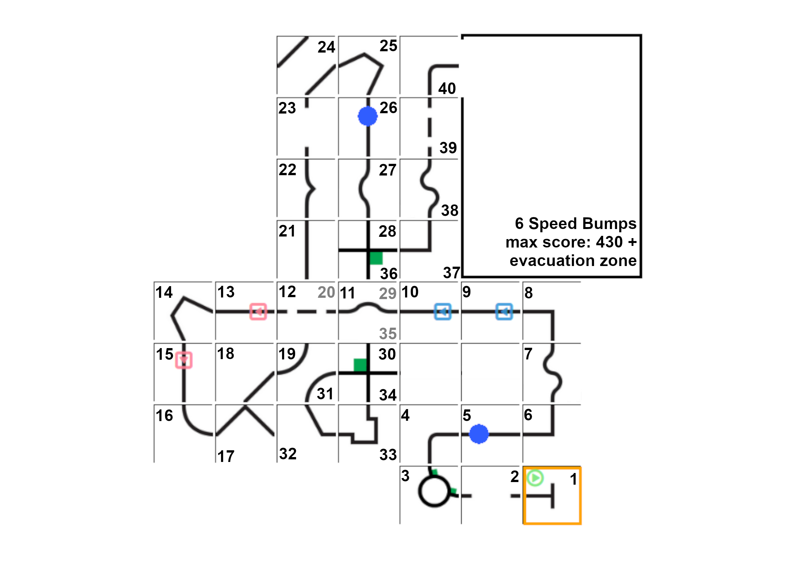

# Parcours Rescue Line 2020

You can find a PDF document containing all parcours [here](./parcours2020.pdf).

Parcours | Tiles | Gaps | Obstacles | Speed Bumps | Ramps | Intersections | Max Score (w/o evacuation zone)
--- | --- | --- | --- | --- | --- | --- | ---
RL Sa 1/C | 39 | 6 | 2 | 5 | 3 | 5 | 390
RL Sa 2/D | 38 | 6 | 1 | 4 | 4 | 6 | 390
RL Su | 40 | 6 | 2 | 6 | 3 | 7 | 430
RLE Sa 1/A r | 35 | 6 | 1 | 2 | 5 | 6 | 370
RLE Sa 2/B r | 37 | 5 | 1 | 4 | 3 | 6 | 370
RLE Sa l | 39 | 6 | 2 | 6 | 3 | 7 | 405

## Line
Line Saturday 1

Line Saturday 2

Line Sunday

## Line Entry
Line Entry Saturday 1 (right)

Line Entry Saturday 2 (right)

Line Entry Sunday (left)

Note: We moved the evacuation zone one tile south, and replaced tile 38 with a right angle.
This removed also tile 39 and thus reduced the maximum score without the evacuation zone to 405 points.
