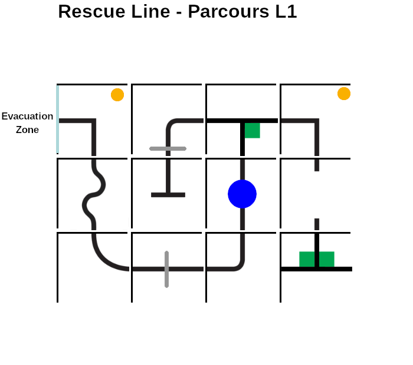

# Parcours Rescue Line 2022

| Parcours | Tiles | Gaps | Obstacles | Speed Bumps | Intersections | Max Score (w/o evacuation zone) |
| -------- | ----- | ---- | --------- | ----------- | ------------- | ------------------------------- |
| L1       | 15    | 2    | 1         | 2           | 3             | 150                             |
| L2       | 13    | 2    | 0         | 3           | 5             | 150                             |
| L3       | 21    | 5    | 1         | 1           | 2             | 150                             |
| L4       | 14    | 2    | 0         | 2           | 5             | 150                             |
| E1       | 16    | 2    | 0         | 0           | 4             | 140                             |
| E2       | 14    | 1    | 1         | 1           | 4             | 140                             |
| E3       | 12    | 3    | 1         | 1           | 3             | 140                             |
| E4       | 12    | 4    | 1         | 1           | 2             | 140                             |

## Line

## Line Entry

